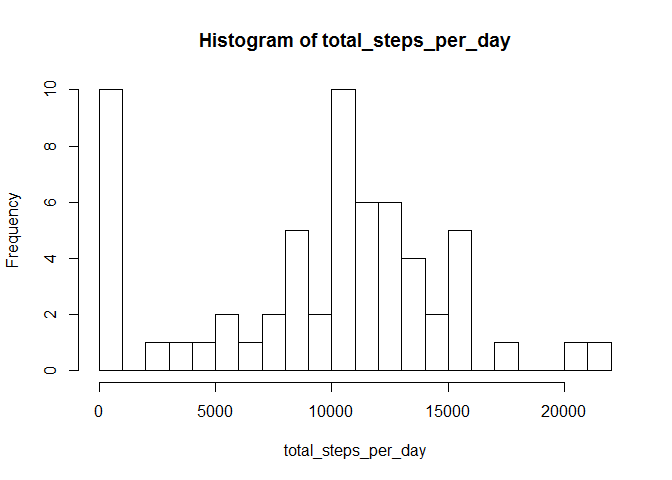
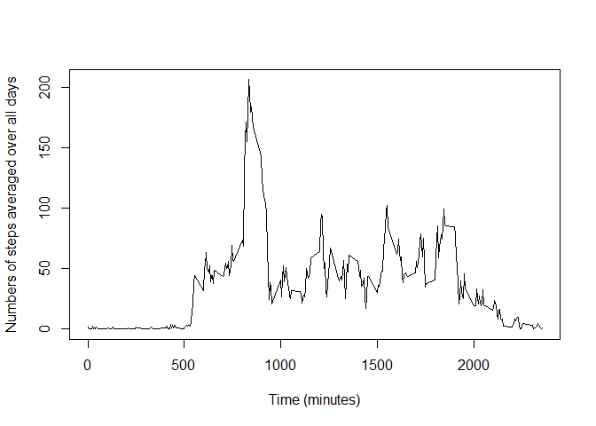
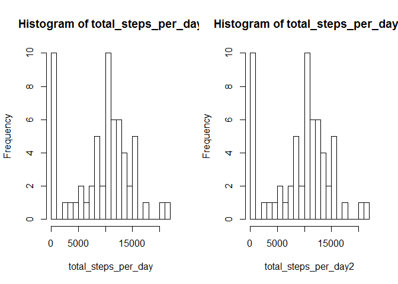
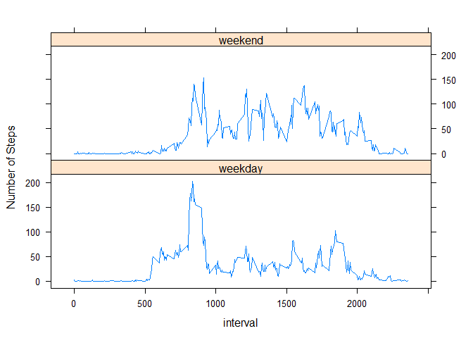

# Reproducible Research: Peer Assessment 1


## Loading and preprocessing the data

```r
unzip("activity.zip")
data_set <- read.csv("activity.csv")
head(data_set)
```

```
##   steps       date interval
## 1    NA 2012-10-01        0
## 2    NA 2012-10-01        5
## 3    NA 2012-10-01       10
## 4    NA 2012-10-01       15
## 5    NA 2012-10-01       20
## 6    NA 2012-10-01       25
```

```r
tail(data_set)
```

```
##       steps       date interval
## 17563    NA 2012-11-30     2330
## 17564    NA 2012-11-30     2335
## 17565    NA 2012-11-30     2340
## 17566    NA 2012-11-30     2345
## 17567    NA 2012-11-30     2350
## 17568    NA 2012-11-30     2355
```

```r
str(data_set)
```

```
## 'data.frame':	17568 obs. of  3 variables:
##  $ steps   : int  NA NA NA NA NA NA NA NA NA NA ...
##  $ date    : Factor w/ 61 levels "2012-10-01","2012-10-02",..: 1 1 1 1 1 1 1 1 1 1 ...
##  $ interval: int  0 5 10 15 20 25 30 35 40 45 ...
```

## What is mean total number of steps taken per day?

1 Calculate the total number of steps taken per day:

```r
total_steps_per_day <- tapply(data_set$steps, data_set$date, sum, na.rm=TRUE)
print(total_steps_per_day)
```

```
## 2012-10-01 2012-10-02 2012-10-03 2012-10-04 2012-10-05 2012-10-06 
##          0        126      11352      12116      13294      15420 
## 2012-10-07 2012-10-08 2012-10-09 2012-10-10 2012-10-11 2012-10-12 
##      11015          0      12811       9900      10304      17382 
## 2012-10-13 2012-10-14 2012-10-15 2012-10-16 2012-10-17 2012-10-18 
##      12426      15098      10139      15084      13452      10056 
## 2012-10-19 2012-10-20 2012-10-21 2012-10-22 2012-10-23 2012-10-24 
##      11829      10395       8821      13460       8918       8355 
## 2012-10-25 2012-10-26 2012-10-27 2012-10-28 2012-10-29 2012-10-30 
##       2492       6778      10119      11458       5018       9819 
## 2012-10-31 2012-11-01 2012-11-02 2012-11-03 2012-11-04 2012-11-05 
##      15414          0      10600      10571          0      10439 
## 2012-11-06 2012-11-07 2012-11-08 2012-11-09 2012-11-10 2012-11-11 
##       8334      12883       3219          0          0      12608 
## 2012-11-12 2012-11-13 2012-11-14 2012-11-15 2012-11-16 2012-11-17 
##      10765       7336          0         41       5441      14339 
## 2012-11-18 2012-11-19 2012-11-20 2012-11-21 2012-11-22 2012-11-23 
##      15110       8841       4472      12787      20427      21194 
## 2012-11-24 2012-11-25 2012-11-26 2012-11-27 2012-11-28 2012-11-29 
##      14478      11834      11162      13646      10183       7047 
## 2012-11-30 
##          0
```

2 Draw the histogram:

```r
hist(total_steps_per_day,breaks=25)
```

<!-- -->

3 Calculate the mean and median:

```r
mean(total_steps_per_day,na.rm=TRUE)
```

```
## [1] 9354.23
```

```r
median(total_steps_per_day,na.rm=TRUE)
```

```
## [1] 10395
```

## What is the average daily activity pattern?

1 Make a time series plot of the 5-minute interval (x-axis) and the average
number of steps taken, averaged across all days (y-axis)


```r
y <- tapply(data_set$steps,data_set$interval, mean, na.rm=TRUE)
x <- as.numeric(names(y))
plot(x,y,type="l",xlab="Time (minutes)",
     ylab="Numbers of steps averaged over all days")
```

<!-- -->

2 Which 5-minute interval, on average across all the days in the dataset,
 contains the maximum number of steps?
 

```r
print(x[y==max(y)])
```

```
## [1] 835
```

```r
print(max(y))
```

```
## [1] 206.1698
```

## Imputing missing values

1 Calculate and report the total number of missing values in the dataset
(i.e. the total number of rows with NAs).


```r
sum(is.na(data_set$steps))
```

```
## [1] 2304
```

2 Use the average steps taken during the day to impute any missing values
(replacing NA's).

```r
ave_steps_per_day <- tapply(data_set$steps,data_set$date,mean,na.rm=TRUE)
ave_steps_per_day[is.nan(ave_steps_per_day)] <- 0
ave_steps <- rep(ave_steps_per_day,each=288)
```

3 Create a new dataset that is equal to the original dataset but with the
missing data filled in.

```r
data_set2 <- data_set
data_set2$steps[is.na(data_set$steps)]<-ave_steps[is.na(data_set$steps)]
sum(is.na(data_set2$steps))
```

```
## [1] 0
```

4 Make a histogram of the total number of steps taken each day and Calculate
and report the mean and median total number of steps taken per day. Do these
values differ from the estimates from the first part of the assignment? What
is the impact of imputing missing data on the estimates of the total daily
number of steps?


```r
total_steps_per_day2 <- tapply(data_set2$steps, data_set2$date, sum)
print(total_steps_per_day2)
```

```
## 2012-10-01 2012-10-02 2012-10-03 2012-10-04 2012-10-05 2012-10-06 
##          0        126      11352      12116      13294      15420 
## 2012-10-07 2012-10-08 2012-10-09 2012-10-10 2012-10-11 2012-10-12 
##      11015          0      12811       9900      10304      17382 
## 2012-10-13 2012-10-14 2012-10-15 2012-10-16 2012-10-17 2012-10-18 
##      12426      15098      10139      15084      13452      10056 
## 2012-10-19 2012-10-20 2012-10-21 2012-10-22 2012-10-23 2012-10-24 
##      11829      10395       8821      13460       8918       8355 
## 2012-10-25 2012-10-26 2012-10-27 2012-10-28 2012-10-29 2012-10-30 
##       2492       6778      10119      11458       5018       9819 
## 2012-10-31 2012-11-01 2012-11-02 2012-11-03 2012-11-04 2012-11-05 
##      15414          0      10600      10571          0      10439 
## 2012-11-06 2012-11-07 2012-11-08 2012-11-09 2012-11-10 2012-11-11 
##       8334      12883       3219          0          0      12608 
## 2012-11-12 2012-11-13 2012-11-14 2012-11-15 2012-11-16 2012-11-17 
##      10765       7336          0         41       5441      14339 
## 2012-11-18 2012-11-19 2012-11-20 2012-11-21 2012-11-22 2012-11-23 
##      15110       8841       4472      12787      20427      21194 
## 2012-11-24 2012-11-25 2012-11-26 2012-11-27 2012-11-28 2012-11-29 
##      14478      11834      11162      13646      10183       7047 
## 2012-11-30 
##          0
```

```r
par(mfrow=c(1,2))
hist(total_steps_per_day,breaks=25)
hist(total_steps_per_day2,breaks=25)
```

<!-- -->

```r
par(mfrow=c(1,1))
mean(total_steps_per_day,na.rm=TRUE)
```

```
## [1] 9354.23
```

```r
median(total_steps_per_day,na.rm=TRUE)
```

```
## [1] 10395
```

```r
mean(total_steps_per_day2)
```

```
## [1] 9354.23
```

```r
median(total_steps_per_day2)
```

```
## [1] 10395
```
The mean and median do not change, the impact of imputing missing data seems to
be zero.

## Are there differences in activity patterns between weekdays and weekends?
1 Create a new factor variable in the dataset with two levels - "weekday" and
"weekend" indicating whether a given date is a weekday or weekend day.


```r
data_set2$date <- strptime(data_set2$date, "%Y-%m-%d")
test <- ifelse(weekdays(data_set2$date) == "Saturday" |
        weekdays(data_set2$date) == "Sunday", "weekend","weekday")
data_set2$weekend_or_weekday <- factor(test)
```

2 Make a panel plot containing a time series plot (i.e. type = "l") of the
5-minute interval (x-axis) and the average number of steps taken, averaged
across all weekday days or weekend days (y-axis)


```r
data_set3 <- aggregate(steps ~ interval + weekend_or_weekday, data= data_set2,
        mean)
library(lattice)
xyplot(steps ~ interval | weekend_or_weekday, data=data_set3,
       layout=c(1,2),type="l",ylab="Number of Steps")
```

<!-- -->
